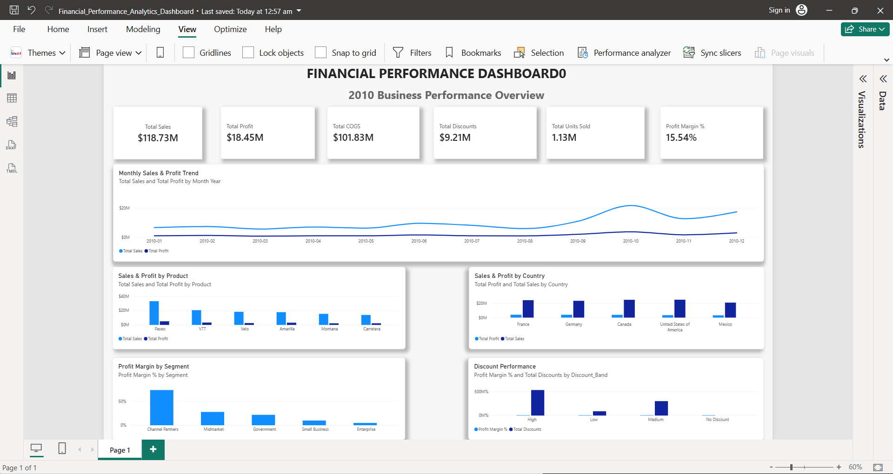
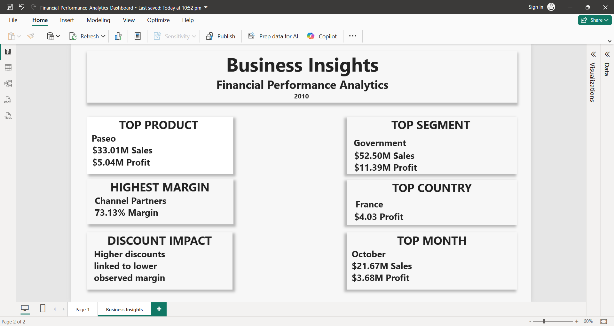

# Financial Performance Analytics

A portfolio project analyzing business and financial performance using **Excel, MySQL, SQL, Power BI, DAX, and Power Query**.

## 📊 Project Overview

This project analyzes the Microsoft Financial Sample dataset for **2010**, covering **700 transactions** across products, countries, customer segments, and discount bands.

The project was built to demonstrate an end-to-end Data Analyst workflow:

**Raw Data → Excel Analysis → SQL Analysis → Power BI Data Model → DAX Measures → Interactive Dashboard → Business Insights**

## 🎯 Business Objective

The analysis focuses on understanding:

- Overall sales and profitability
- Product performance
- Country-level performance
- Segment profitability
- Discount performance
- Monthly sales and profit trends
- Business areas that contribute most to revenue and profit

## 📁 Dataset

**Source:** Microsoft Financial Sample

Key fields include:

- Segment
- Country
- Product
- Discount Band
- Units Sold
- Manufacturing Price
- Sale Price
- Gross Sales
- Discounts
- Sales
- COGS
- Profit
- Date

The dataset covers transactions from **January 2, 2010 to December 2, 2010**.

## 🛠️ Tools & Technologies

| Tool | Purpose |
|---|---|
| **Excel** | Data inspection, cleaning, calculations and analysis |
| **MySQL** | Database storage and SQL analysis |
| **SQL** | Business queries and aggregation |
| **Power BI** | Interactive dashboard and visualization |
| **DAX** | KPI and analytical measures |
| **Power Query** | Data transformation and preparation |

## 🔎 Data Quality Checks

The dataset was checked for:

- Duplicate records
- NULL values
- Negative units sold
- Negative sales
- Date validity
- Data types

Results from the completed SQL validation:

- **Rows:** 700
- **Duplicate rows:** 0
- **Rows with NULL values:** 0
- **Negative units sold:** 0
- **Negative sales:** 0

## 🧮 Key KPIs

| KPI | Result |
|---|---:|
| Total Transactions | 700 |
| Total Units Sold | 1.13M |
| Total Sales | $118.73M |
| Total COGS | $101.83M |
| Total Discounts | $9.21M |
| Total Profit | $18.45M |
| Profit Margin | 15.54% |

## 🗄️ SQL Analysis

The cleaned data was loaded into a MySQL database named:

`financial_analysis`

Main table:

`financial_data`

SQL analysis was performed across:

- Overall business performance
- Product performance
- Country performance
- Segment performance
- Discount bands
- Monthly sales and profit

The SQL scripts and CSV data are included in the `SQL` folder.

## 📈 Power BI Dashboard

The Power BI report contains two pages:

### Page 1 — Financial Performance Dashboard

The executive dashboard includes:

- Total Sales
- Total Profit
- Total COGS
- Total Discounts
- Total Units Sold
- Profit Margin %
- Monthly Sales & Profit Trend
- Sales & Profit by Product
- Sales & Profit by Country
- Profit Margin by Segment
- Discount Performance

### Page 2 — Business Insights

The second page summarizes the major findings from the analysis in a business-friendly format.

## 💡 Key Business Insights

### 1. Paseo was the highest-performing product by sales and profit

- Sales: **$33.01M**
- Profit: **$5.04M**
- Profit Margin: **15.26%**

### 2. Government was the largest segment by sales and profit

- Sales: **$52.50M**
- Profit: **$11.39M**
- Profit Margin: **21.69%**

### 3. Channel Partners recorded the highest segment-level profit margin

- Sales: **$1.80M**
- Profit: **$1.32M**
- Profit Margin: **73.13%**

Its revenue contribution was considerably smaller than the larger segments.

### 4. France generated the highest absolute country-level profit

- Sales: **$24.35M**
- Profit: **$4.03M**
- Profit Margin: **16.56%**

Germany had a slightly higher profit margin at **16.85%**.

### 5. Higher discount bands were associated with lower observed profit margins

| Discount Band | Profit Margin |
|---|---:|
| No Discount | 21.86% |
| Low | 17.87% |
| Medium | 15.19% |
| High | 12.40% |

This is an observed association in the dataset and does not by itself establish that discounts caused the lower margins.

### 6. October recorded the strongest monthly sales and profit

**October 2010**

- Sales: **$21.67M**
- Profit: **$3.68M**
- Units Sold: **201,104**

The dataset ends on **December 2, 2010**, so December represents only a partial month.

## 🖼️ Dashboard Preview

### Executive Dashboard



### Business Insights



## 📂 Project Structure

```text
Financial Performance Analytics/
│
├── Data/
│   └── Financial_Performance_Analytics_Raw.xlsx
│
├── Excel/
│   └── financial_analysis.xlsx
│
├── SQL/
│   ├── financial_data.csv
│   └── financial_data.sql
│
├── PowerBI/
│   └── Financial_Performance_Analytics_Dashboard.pbix
│
├── insights/
│   └── Business_Insights.md
│
├── screenshots/
│   ├── dashboard.png
│   └── business_insights.png
│
└── README.md
```

## 🧠 Skills Demonstrated

- Data cleaning and validation
- Excel analysis
- SQL querying
- MySQL database management
- Data aggregation
- KPI development
- DAX
- Power BI dashboard development
- Data modeling
- Business analysis
- Data visualization
- Business insight generation
- Portfolio documentation

## 📌 Project Outcome

This project demonstrates an end-to-end approach to transforming raw business data into:

**Clean Data → Structured Database → SQL Analysis → Analytical Measures → Interactive Dashboard → Business Insights**

The project is designed as part of a Data Analyst portfolio and emphasizes both technical analysis and business interpretation.
